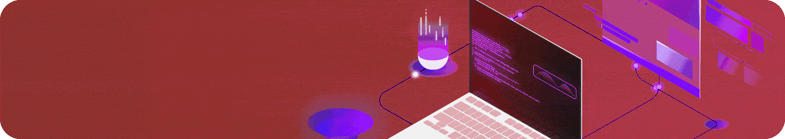

<!--

  <a href="./README.md">English</a> • <a href="./locales/README.ar.md">العربية</a> • <a href="./locales/README.zh.md">简体中文</a> • <a href="./locales/README.hi.md">हिन्दी</a> • <a href="./locales/README.es.md">Español</a> • <a href="./locales/README.fr.md">Français</a> • <a href="./locales/README.pt.md">Português</a> • <a href="./locales/README.de.md">Deutsch</a> • <a href="./locales/README.id.md">Bahasa Indonesia</a> • <a href="./locales/README.ur.md">اردو</a> • <a href="./locales/README.ru.md">Русский</a> • <a href="./locales/README.ja.md">日本語</a>

-->

<h1 align="center"> Hi, I’m Saad.</h1> 

    
  

<h2 align="center" id="technologies">🛠️ Technologies</h2>

<table>
  <tr>
    <td align="left"><b>Languages</b></td>
    <td>
      
      
      
      
      
      
      
      
      
      
      
    </td>
  </tr>
  <tr>
    <td align="left"><b>Frameworks & Libraries</b></td>
    <td>
      
      
      
      
      
      
      
      
      
      
      
      
      
      
      
      
      
      
      
      
    </td>
  </tr>
  <tr>
    <td align="left"><b>Databases</b></td>
    <td>
      
      
      
      
      
      
      
      
      
    </td>
  </tr>
  <tr>
    <td align="left"><b>Tools</b></td>
    <td>
      
      
      
      
      
      
      
      
      
      
      
      
      
      
      
      
      
      
      
      
      
      
      
      
      
    </td>
  </tr>
</table>

<!-- https://github.com/DenverCoder1/custom-icon-badges -->

<h2 align="center">🌐 Connect & Profiles</h2>

| Category | Links & Platforms |
|:---|:---|
| **Direct Contact** | 📧 [reach.saad@outlook.com](mailto:reach.saad@outlook.com) *(Best Method)* • 💬 [Discord](https://discord.com/users/1044305442496585818) • 💼 [LinkedIn](https://www.linkedin.com/in/saad2134/) |
| **Developer Profiles** |    |
| **Social Media** |      |

<h2 align="center" id="live-stats">📈 Live Stats</h2>

| Description | Stats |
|:---:|:---:|
| GitHub profile view counter. |  |
| Most used languages in my repos. |  |
| GitHub Stats. |  |
| GitHub Streak. |   |
| GitHub Contribution Graph. |   |

<h2 align="center" id="github-trophies">🏆 GitHub Trophies</h2>
<a href="#github-trophies"><picture>
  <source media="(max-width: 1024px)" srcset="https://github-trophies.vercel.app/?username=saad2134&theme=gruvbox&no-frame=true&row=2&column=4&margin-w=10&margin-h=10" />
  
</picture></a>

<h2 align="center" id="support-me">✨ Support Me</h2>

  
  
  

  
💳 <b>Fiat & Creator Platforms QR Codes (Buy Me a Coffee / PayPal)</b>

   
  

    
☕ <b>Buy Me A Coffee QR Code</b>

     
    

      
    

  

   
  

    
🅿️ <b>PayPal QR Code</b>

     
    

      
    

  

  
💰 <b>Cryptocurrency QR Codes (Click to choose a coin)</b>

   
  

    
🟧 <b>Bitcoin (BTC) QR Code</b>

     
    

      
    

  

   
  

    
🔷 <b>Ethereum (ETH) QR Code</b>

     
    

      
    

  

   
  

    
🟣 <b>Solana (SOL) QR Code</b>

     
    

      
    

  

   
  

    
🌐 <b>Other Cryptos QR Code (NOWPayments)</b>

     
    

      
    

  

## ✍️ Endnote

  ✨ <em>Thank you for stopping by and taking the time to explore my profile!</em> 

---

  © <strong>Saad (@saad2134 & @saad1inc)</strong>: All projects not published under an open-source license are the copyright of the author and/or collaborators.

